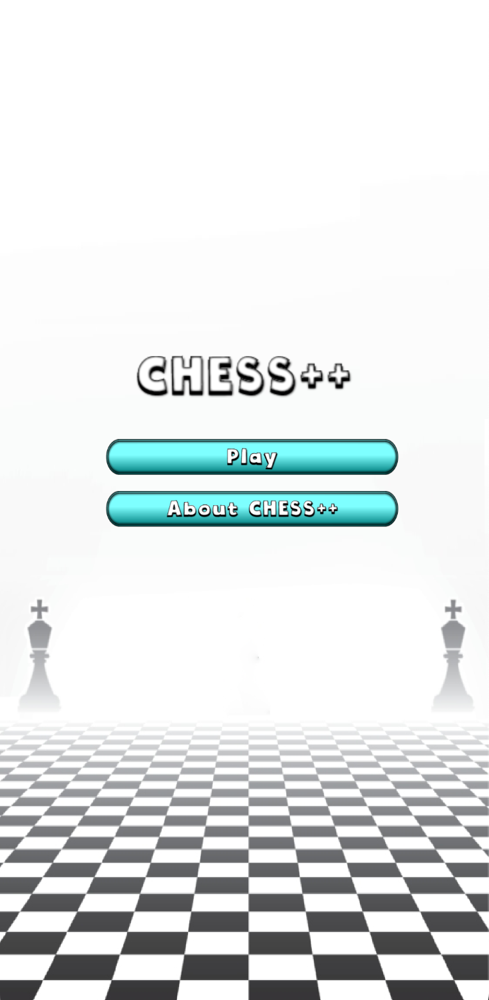

# Group Project in TDT4240 - Software Architecture

This is the android application Chess++. It is an online multiplayer game where you can play one of many chess variants.



## Built with

- Kotlin 🤖
- LibGDX 🎮
- Firebase Realtime Database 🏦

## How to run the project

### Prerequisites

- Git
- JVM version 17
- Gradle 8.6
- Install locally:

```
https://github.com/isaksolheim/chess.git
```

- Android studio with Android SDK

### Start the app

In android studio, make sure to have an [emulated device](https://developer.android.com/studio/run/emulator) running.

Navigate to the root of the project in a terminal. Run the project with:

```
./gradlew :android:run
```

### Run the tests

In a terminal, in the root of the project:

```
./gradlew :core:test
```

Test report can be found in ./core/build/report/tests/index.html

Generate jacoco coverage report with:

```
./gradlew :core:jacocoTestReport
```

It can be found in ./core/build/report/jacocoHtml/index.html

## Project Structure

The project is structured as follows:

- `android`: Subproject for android.
- `core`: Subproject for the chess logic and views.
  - `src/me/isak/chess`: Source code
    - `model`:
      - `base`: All version agnostic chess logic
      - `versions`: Folder with source code specific for each version of chess
        - `fischer`
        - `horde`
        - `koth`: King of the Hill
        - `racing`: Racing Kings
        - `Standard`
        - `threecheck`: Three Check
    - `sound`: Sounds and controller
    - `viewmodels`: Binds model and views together
    - `views`: Different views presented to the user
  - `test/me/isak/chess`: Test for chess logic
    - `integration`: Tests for running of full games of each version
    - `model/core`: Unit tests for chess logic
