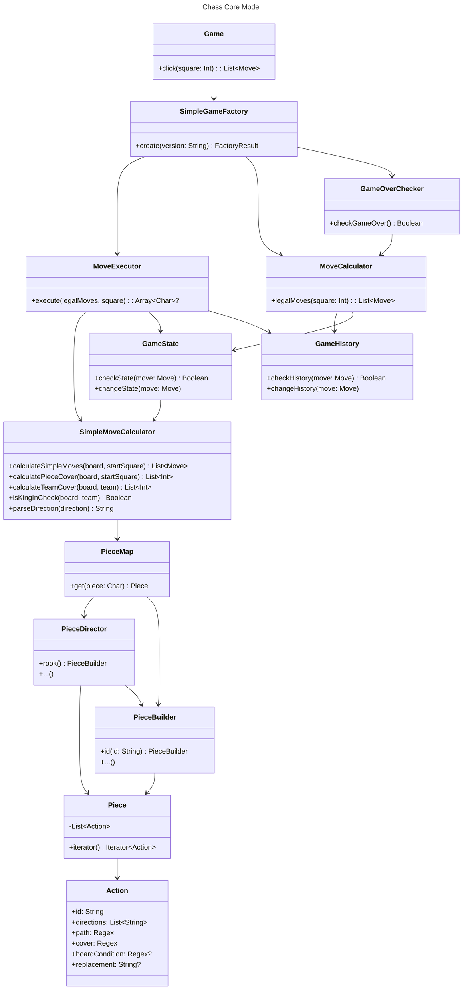

# Chess base

This folder includes the code for the model part of the application. This code is separated from code found in model/versions/*, because they should not change when creating a new version of chess.

The one exception to this is SimpleGameFactory, which needs to add logic for the creation of a new version.

Here is a diagram showing how all the classes in this folder works together.

